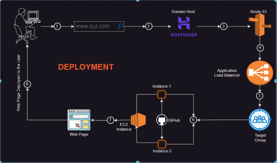

# PROJECT-1
## Title:   Deployment of a Web Page
### Deployment of a web page using Amazon EC2 instance, GIT Hub and Nginx in the AWS Cloud Platform.
_______________________
## Deployment Steps
1. **Amazon EC2 Instance Creation:**
   - Launch an EC2 instance on the AWS console.
   - Choose the appropriate instance type (T2 Micro), configure security groups, and obtain the key pair.
   - Connect to the server and
   - ```bash
     sudo-s # super user (root)
     ```
     ```bash
     apt-get update # update package index
     ```
     ```bash
     clear # clear the screen
     ```
2. **Nginx installation:**
   - ```bash
     apt-get install nginx -y
     ```
   - To check the Nginx status
   - ```bash
     systmctl status nginx #to start
     ```
   - ```bash
     systmctl restart nginx # to restart the nginx
   - After Nginx got installed go to the  nginx path ie.,
   - ```bash
     cd /var/www/html/
     ```
   - You can find the .html file there.
   - ```bash
     cat index.html #to view the file
     ```
   - ```bash
     vi index.html # to edit the data inside the file
     ```
3. **Clone the Repository:**
   - Clone the Repository from the GIT Hub to the instance.
   - ```bash
     git clone https://github.com/your-username/your-repository.git #copy paste the link from the github repository
     ```
   - ```bash
     cd repository_name # open that Repository
     ```
   - Now we have to move all the files inside the repository to the html directory
   - ```bash
     mv * ../ #to move all the files from this repository to one step back
     ```
   - ```bash
     cd .. #one step back
     ```
   - ```bash
     em -rf repository-name #remove the empty repository since all the files inside it have already been moved
     ```
4. **Access the Web Page**
   - Go to the EC2 instance details, then to security and click on the security group that we have created at the time of launching the instance.
   - Edit inbound rules. Add port number 80 (nginx port) and save.
   - Now, copy the instance public IP and paste it into any browser's search bar and add ":80".
## Deployment Video:
[Watch the full video](videos/p-1.mp4)

__________________________________________________________________________________________________________________________________________________________________________________________________________________________________________________________________________________________________________________________________________________________________________
# PROJECT-2
## Title: Deployment of a web page
#### Deployment of a web page using Amazon EC2 instances, Application Load Balancing, Route 53, domain from hostinger, and GIT Hub.
### Architecture:
_______________
1. **EC2 instances creation:
   - Create two or more EC2 instances.
   - Install nginx or apache2 in both the instances that you have created.
     ```bash
     sudo -s
     ```
     ```bash
     apt-get update
     ```
     ```bash
     apt-get install nginx -y
     ```
     or
     ```bash
     apt-get install apache2 -y
     ```
   - Now open the nginx/apache2 file path.
     ```bash
     cd /var/www/html
     ```
   - Now open github account and copy the url of the file that which you want to deploy and add to these instances.
     ```bash
     git clone "paste_the_github_url_here"
     ```
     ```bash
     cd file_name
     ```
     ```bash
     mv * ..
     ```
     ```bash
     cd ..
     ```
     ```bash
     rm -rf file_name
     ```
   - Now edit the bound rules in the security groups of the instances and add port 80 in it where nginx and apache port number is 80.
2. **
